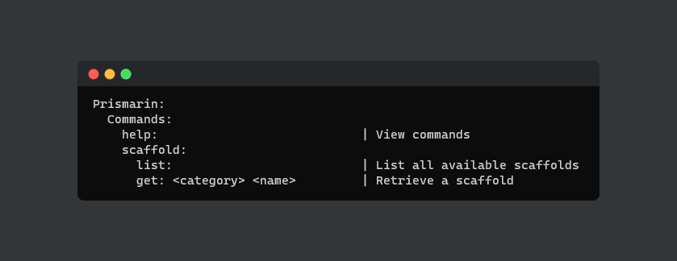

# Prismarin CLI

Simplify your life when using prismarin scaffolds and tools



## Prerequisite

 - Go v1.18 (if you want to build it yourself)

## Installation

Download latest [release](https://github.com/prismarin-network/prismarin-cli/releases) and add it your PATH
<br>

Manually (if you have go installed):
```
git clone https://github.com/prismarin-network/prismarin-cli.git
go mod download
go build
go install
```

## Licensing

Distributed under the MIT License. See [LICENSE](LICENSE) for more information.
